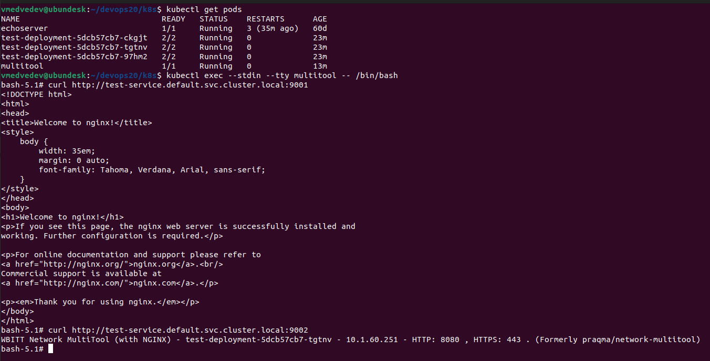
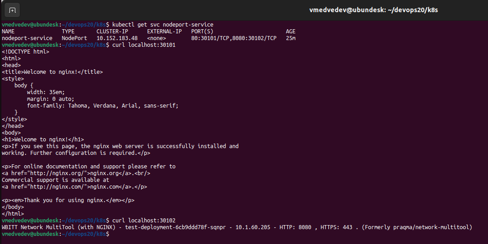

# Сетевое взаимодействие в K8S. Часть 1

## Задание 1


```
apiVersion: apps/v1
kind: Deployment
metadata:
  name: test-deployment
spec:
  replicas: 3
  selector:
    matchLabels:
      app: test-app
  template:
    metadata:
      labels:
        app: test-app
    spec:
      containers:
      - name: nginx
        image: nginx:1.14.2
        ports:
        - containerPort: 80
      - name: multitool
        image: wbitt/network-multitool:latest
        ports:
        - containerPort: 8080
        env:
        - name: HTTP_PORT
          value: "8080"

---
apiVersion: v1
kind: Service
metadata:
  name: test-service
spec:
  selector:
    app: test-app
  ports:
    - name: nginx
      protocol: TCP
      port: 9001
      targetPort: 80
    - name: multitool
      protocol: TCP
      port: 9002
      targetPort: 8080

---
apiVersion: v1
kind: Pod
metadata:
  name: multitool
spec:
  containers:
  - name: multitool
    image: wbitt/network-multitool:latest
    ports:
      - containerPort: 80
        name: multitool-svc
```

## Задание 2

```
apiVersion: v1
kind: Service
metadata:
  name: nodeport-service
spec:
  type: NodePort
  selector:
    app: test-app
  ports:
    - name: nginx-port
      protocol: TCP
      port: 80
      nodePort: 30101
    - name: multitool-port
      protocol: TCP
      port: 8080
      nodePort: 30102
```