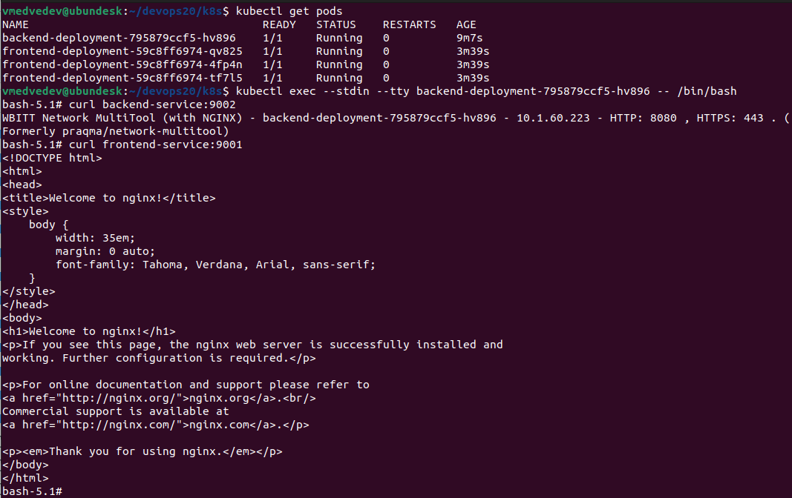
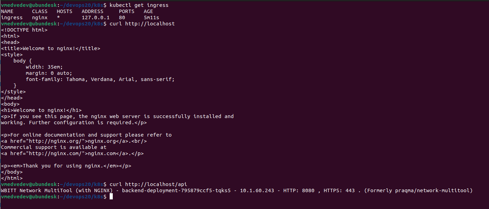

# Сетевое взаимодействие в K8S. Часть 2





```
---
apiVersion: apps/v1
kind: Deployment
metadata:
  name: frontend-deployment
spec:
  replicas: 3
  selector:
    matchLabels:
      app: frontend
  template:
    metadata:
      labels:
        app: frontend
    spec:
      containers:
      - name: nginx
        image: nginx:1.14.2
        ports:
        - containerPort: 80

---
apiVersion: apps/v1
kind: Deployment
metadata:
  name: backend-deployment
spec:
  selector:
    matchLabels:
      app: backend
  template:
    metadata:
      labels:
        app: backend
    spec:
      containers:
      - name: multitool
        image: wbitt/network-multitool:latest
        ports:
        - containerPort: 8080
        env:
        - name: HTTP_PORT
          value: "8080"        

---
apiVersion: v1
kind: Service
metadata:
  name: frontend-service
spec:
  selector:
    app: frontend
  ports:
    - name: nginx
      protocol: TCP
      port: 9001
      targetPort: 80

---
apiVersion: v1
kind: Service
metadata:
  name: backend-service
spec:
  selector:
    app: backend
  ports:
    - name: multitool
      protocol: TCP
      port: 9002
      targetPort: 8080

---
apiVersion: networking.k8s.io/v1
kind: Ingress
metadata:
  name: ingress
  annotations:
    kubernetes.io/ingress.class: "nginx"
    nginx.ingress.kubernetes.io/rewrite-target: /$1
spec:
  rules:
    - http:
        paths:
          - path: /api
            pathType: Prefix
            backend:
              service:
                name: backend-service 
                port:
                  number: 9002        
          - path: /
            pathType: Prefix
            backend:
              service:
                name: frontend-service 
                port:
                  number: 9001
  ingressClassName: nginx                  
```