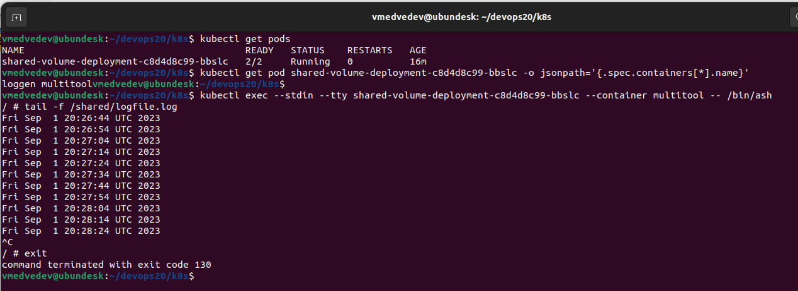
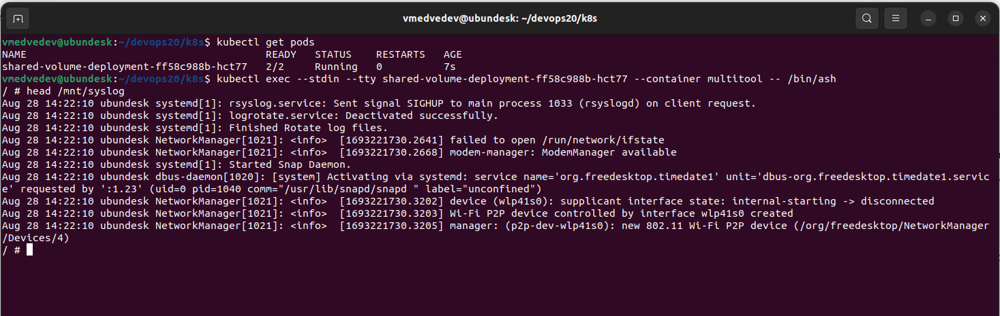

# Сетевое взаимодействие в K8S. Часть 2





```
---
apiVersion: apps/v1
kind: Deployment
metadata:
  name: shared-volume-deployment
spec:
  replicas: 1
  selector:
    matchLabels:
      app: shared-volume-deployment
  template:
    metadata:
      labels:
        app: shared-volume-deployment
    spec:
      containers:
      - name: loggen
        image: svinopterix/loggen:v1.1
        env:
        - name: LOG_FILE
          value: "/shared/logfile.log"
        volumeMounts:
        - mountPath: /shared
          name: shared-volume
      - name: multitool
        image: wbitt/network-multitool:latest
        ports:
        - containerPort: 8080
        env:
        - name: HTTP_PORT
          value: "8080"  
        volumeMounts:
        - name: shared-volume
          mountPath: /shared          
        - name: host-logs
          mountPath: /mnt
          readOnly: true     
      volumes:
      - name: shared-volume
        emptyDir:
          sizeLimit: 10Mi
      - name: host-logs
        hostPath: 
          path: /var/log/

---
apiVersion: v1
kind: Service
metadata:
  name: multitool-service
spec:
  selector:
    app: shared-volume-deployment
  ports:
    - name: multitool
      protocol: TCP
      port: 9002
      targetPort: 8080           
```

## Dokerfile для создания контейнера, генерирующего логи (для задания №1)
```
FROM busybox

COPY ./generate-logs.sh /generate-logs.sh
RUN chmod +x /generate-logs.sh

CMD ["/generate-logs.sh"]
```

## Скрипт, генерирующий логи в общий том (для задания №1)
```
#!/bin/ash

# Check if the LOG_FILE environment variable is set
if [ -z "$LOG_FILE" ]; then
  LOG_FILE="./logfile.log"  # Default log file in the current directory
else
  LOG_FILE="$LOG_FILE"     # Use the specified log file from the environment variable
fi

echo "Generating logs to file $LOG_FILE"

# Infinite loop to write the date to the log file every 10 seconds
while true; do
  date >> "$LOG_FILE"
  sleep 10
done
```