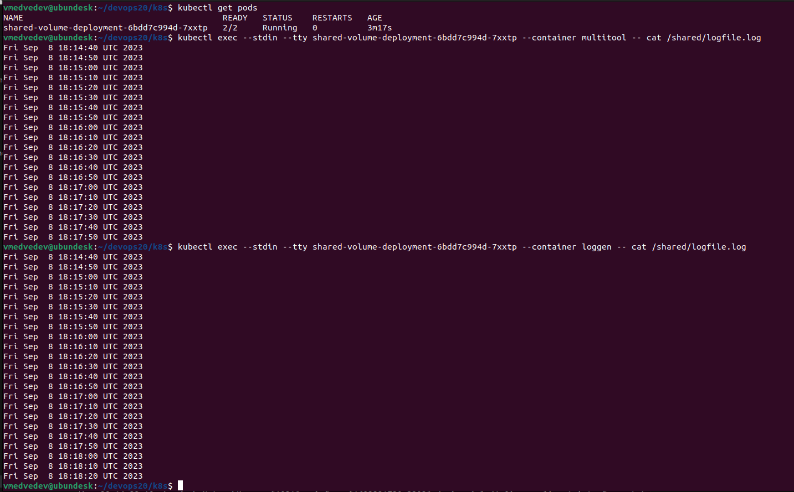
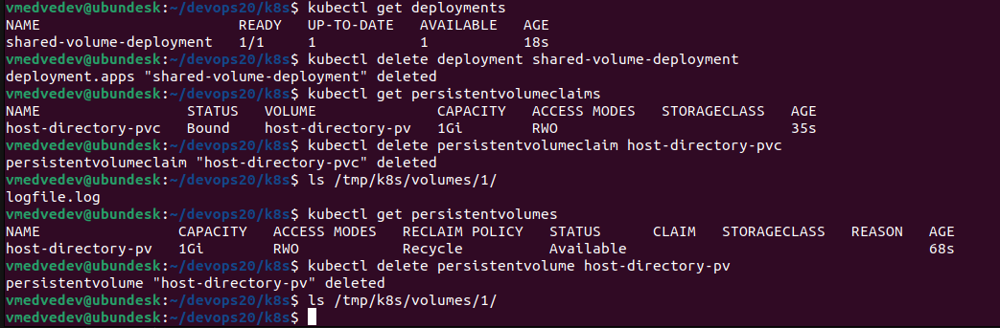
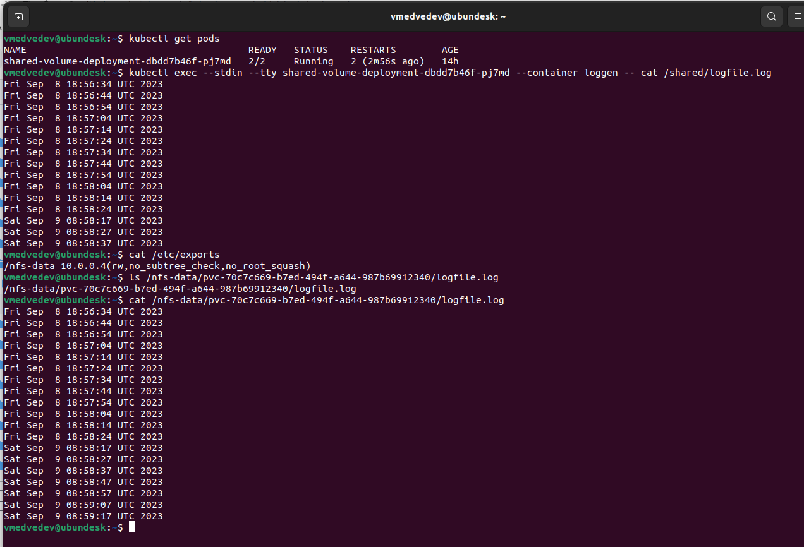

# K8S Хранение ч.2

## Задание 1

Ниже скриншоты и манифест.

1. Демонстрация наличия доступа к общему тому из разных контейнеров деплоймента. В качестве генератора логов использовал тот же контейнер, что и в прошлом ДЗ: с контейнером loggen, который пишет в файл текущую дату-время каждые несколько секунд.


2. При удалении деплоймента и PVC сам том с его содержимым остаётся. При удалении тома поведение зависит от параметра тома persistentVolumeReclaimPolicy. В примере ниже значение этого параметра: Recycle - при удалении тома происходит очистка соответствующей директории.


```
---
apiVersion: apps/v1
kind: Deployment
metadata:
  name: shared-volume-deployment
spec:
  replicas: 1
  selector:
    matchLabels:
      app: shared-volume-deployment
  template:
    metadata:
      labels:
        app: shared-volume-deployment
    spec:
      containers:
      - name: loggen
        image: svinopterix/loggen:v1.1
        env:
        - name: LOG_FILE
          value: "/shared/logfile.log"
        volumeMounts:
        - mountPath: /shared
          name: shared-volume
      - name: multitool
        image: wbitt/network-multitool:latest
        ports:
        - containerPort: 8080
        env:
        - name: HTTP_PORT
          value: "8080"  
        volumeMounts:
        - name: shared-volume
          mountPath: /shared          
      volumes:
      - name: shared-volume
        persistentVolumeClaim:
          claimName: host-directory-pvc      

---
apiVersion: v1
kind: PersistentVolumeClaim
metadata:
  name: host-directory-pvc
spec:
  accessModes:
    - ReadWriteOnce
  resources:
    requests:
      storage: 1Gi

---
apiVersion: v1
kind: PersistentVolume
metadata:
  name: host-directory-pv
spec:
  capacity:
    storage: 1Gi
  volumeMode: Filesystem
  accessModes:
    - ReadWriteOnce
  persistentVolumeReclaimPolicy: Recycle
  hostPath:
    path: /tmp/k8s/volumes/1
```

## Задание 2

Ниже манифесты создания Storage Class и Deployment. Deployment взял тот же, что и в прошлый раз, с контейнером loggen, который пишет в файл текущую дату-время каждые несколько секунд.



```
# sc-nfs.yaml
---
apiVersion: storage.k8s.io/v1
kind: StorageClass
metadata:
  name: nfs-csi
provisioner: nfs.csi.k8s.io
parameters:
  server: 10.0.0.4
  share: /nfs-data
reclaimPolicy: Delete
volumeBindingMode: Immediate
mountOptions:
  - hard
  - nfsvers=4.1
```

```
---
apiVersion: apps/v1
kind: Deployment
metadata:
  name: shared-volume-deployment
spec:
  replicas: 1
  selector:
    matchLabels:
      app: shared-volume-deployment
  template:
    metadata:
      labels:
        app: shared-volume-deployment
    spec:
      containers:
      - name: loggen
        image: svinopterix/loggen:v1.1
        env:
        - name: LOG_FILE
          value: "/shared/logfile.log"
        volumeMounts:
        - mountPath: /shared
          name: shared-volume
      - name: multitool
        image: wbitt/network-multitool:latest
        ports:
        - containerPort: 8080
        env:
        - name: HTTP_PORT
          value: "8080"  
        volumeMounts:
        - name: shared-volume
          mountPath: /shared          
      volumes:
      - name: shared-volume
        persistentVolumeClaim:
          claimName: nfs-pvc

---
apiVersion: v1
kind: PersistentVolumeClaim
metadata:
  name: nfs-pvc
spec:
  storageClassName: nfs-csi
  accessModes: [ReadWriteOnce]
  resources:
    requests:
      storage: 1Gi

---
apiVersion: v1
kind: Service
metadata:
  name: multitool-service
spec:
  selector:
    app: shared-volume-deployment
  ports:
    - name: multitool
      protocol: TCP
      port: 9002
      targetPort: 8080
```