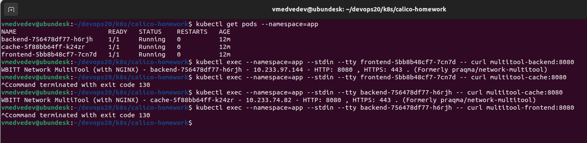

# Применение network policy

## Манифесты
 - [namespace.yaml](k8s/calico-homework/namespace.yaml) - создание неймспейса
 - [deployments.yaml](k8s/calico-homework/deployments.yaml) - создание деплойментов frontend, cache, backend и сервисов multitool-frontend, multitool-cache, multitool-backend
 - [network_policy.yaml](calico-homework/network_policy.yaml) - создание network policy

## Ограничение трафика

